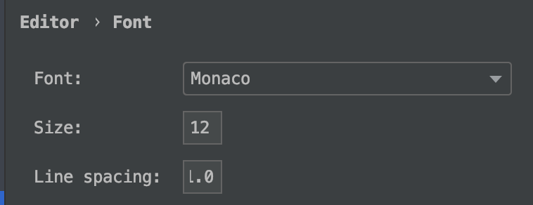
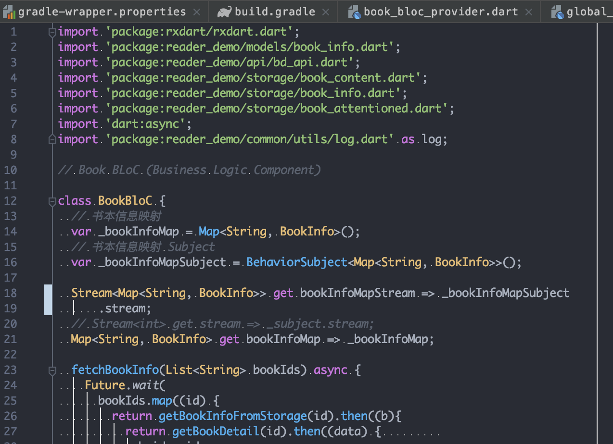

# Android Studio 安装配置

### 简介

[Android Studio](https://developer.android.com/studio/?hl=zh-cn) 是一个Android开发环境，基于 IntelliJ IDEA. 类似 Eclipse ADT，Android Studio 提供了集成的 Android 开发工具用于开发和调试。
虽然比 [VSCode](https://code.visualstudio.com/) 重，但由于它的调试功能比较优秀。所以在后期调试会发挥作用

### gradle 配置

安装过程就略过，到官网下载安装就可以。

下面说以下重新装 gradle 折腾了一个下午的坑

一般由于被墙造成的安装失败的问题参考 [《如何配置Futter gradle镜像》](https://segmentfault.com/q/1010000016775662/a-1020000016788604) 就可以解决

我遇到的问题是在安装 Android Studio 的时候，它提示我为 gradle 配置 proxy。

> 这个配置是配置在 ~/.gradle/gradle.properties 里的
> 这个配置是配置在 ~/.gradle/gradle.properties 里的
> 这个配置是配置在 ~/.gradle/gradle.properties 里的

重要的事情说三遍。 然后 gradle 的下载会全部走这个配置的 proxy, 与 AS 配置的 proxy 无关。我就是由于这个 proxy 配置错了，然后把关注点锁定在 AS 上，导致一直在原地打转。

以后遇到相同问题，请先检查下 `~/.gradle/gradle.properties` 这个文件

```
systemProp.https.proxyPort=1087
systemProp.http.proxyHost=127.0.0.1
systemProp.https.proxyHost=127.0.0.1
systemProp.http.proxyPort=1087
```
看看有没有配置 proxy， 如果配置了，配的是否正确

### 主题配置

AS 的默认配色太难看了，根本无法提起编码激情 (虽然配完也不如VSCode，但聊胜于无 --||)


目录等系统字体比较喜欢 Menlo



编辑器字体比较喜欢 Manaco


主题选择 [Atom One Dark](http://color-themes.com/?view=index&page=1&order=popular&search=atom&layout=Generic)，很喜欢的 
Atom 的主题，虽然已经不用 Atom 了，但在 AS 上主题的表现和 VSCode 上一个天一个地，需要手动调整，调整完还是有差距，凑合用。主题使用方法很简单，下载主题的jar包，然后 `File > Import Settings...`。



最终表现就是这样的，基本可以开始编码了。