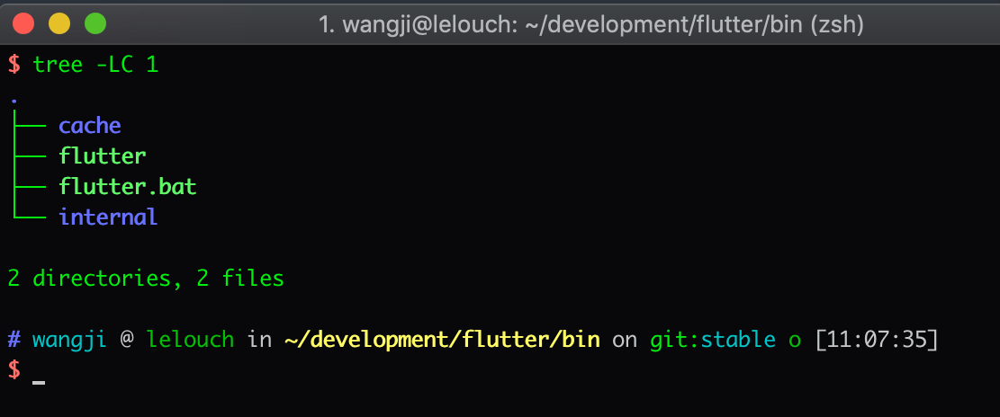
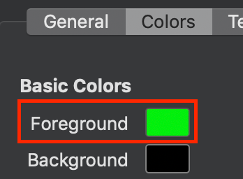

# iTerm2

### 简介

[iTerm2](https://www.iterm2.com/)是用来替代 OSX 默认 Terminal 的免费应用，它提供了丰富的新特性和可配置项让终端用起来更个性化和便捷



### 配置

隐藏滚动条


默认文字颜色调节为绿色



光标改为下划线


窗体半透明，默认窗体大小


### 安装 oh-my-zsh

[oh-my-zsh](https://github.com/robbyrussell/oh-my-zsh) 是一个开源项目，它自动帮你完成 zsh 的复杂配置

```shell
sh -c "$(curl -fsSL https://raw.githubusercontent.com/robbyrussell/oh-my-zsh/master/tools/install.sh)"
```

### 配置 oh-my-zsh

```
vim ~/.zshrc
```

修改主题和添加插件

```
...

ZSH_THEME="ys"

...

# git 提供了 git 操作的 alias
# extract 在终端中运行 x sample.zip 可以自动识别解压文件
# z 通过给出文件夹名片段到达历史最常去的匹配文件夹 (非常好用的导航命令，谁用谁知道)
# zsh-autosuggestions 历史命令联想
plugins=(git extract z zsh-autosuggestions) 

```

安装 [zsh-autosuggestions](https://github.com/zsh-users/zsh-autosuggestions)

```
git clone https://github.com/zsh-users/zsh-autosuggestions ${ZSH_CUSTOM:-~/.oh-my-zsh/custom}/plugins/zsh-autosuggestions
```

生效配置

```
~/.zshrc
```

### VIM 语法高亮

```
vim ~/.vimrc
```

配置保存

```
syntax on
set ruler
```