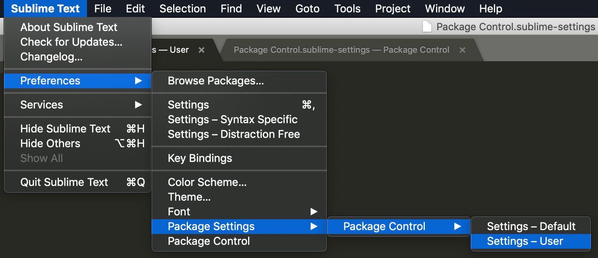
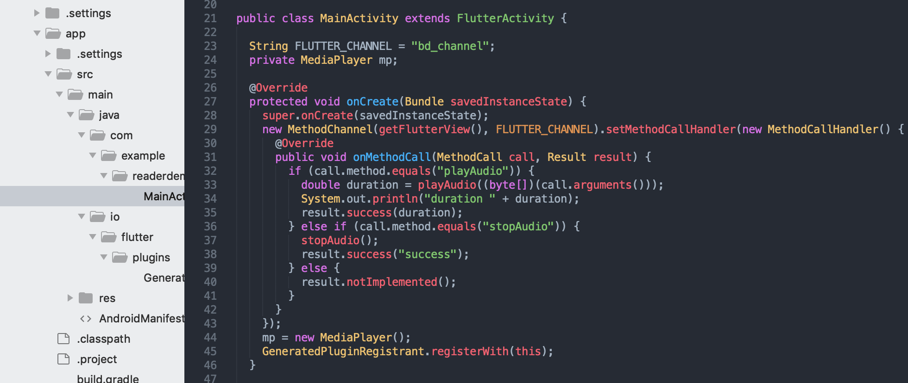

# Sublime Text3 安装配置

### 简介

[Sublime](https://www.sublimetext.com/) 是一款用 python 写的轻量级文本编辑器，可以用它编码，也可以作为灵感的临时存储媒介。由于可以做到秒开秒关，在需要做临时记录的时候经常会用到

### 安装 Package Control

Package Control 是 Sublime 的一个包管理工具，由于种种中国特色的原因，这里选择手动安装

1. 下载 [Package Control](https://packagecontrol.io/Package%20Control.sublime-package) 
2. 在 sublime 的菜单栏里，点击`preferences->Browse Packages…`
3. 在打开目录的上级目录,找到`Installed Packages`文件夹，把刚才下载的插件放在这里即可
4. 重启sublime,检查是否安装成功。
5. 为 Package Control 配置 Proxy 



```
{
	"bootstrapped": true,
	"http_proxy": "http://127.0.0.1:1087",
	"https_proxy": "http://127.0.0.1:1087",
}
```

### 安装主题

`CMD + SHIFT + P` > `Install Package` > `Theme - One Dark` 安装

安装完成后 `Preferences > Color Scheme...` 选择 `One Dark`

> 由于主题并不是太好看就只安装了 文本颜色

`Preferences > Settings` 修改字体和缩进

```json
{
	"color_scheme": "Packages/One Dark Material - Theme/schemes/OneDark.tmTheme",
	"font_face": "Manaco",
	"font_size": 12,
	"tab_size": 2,
}
```

