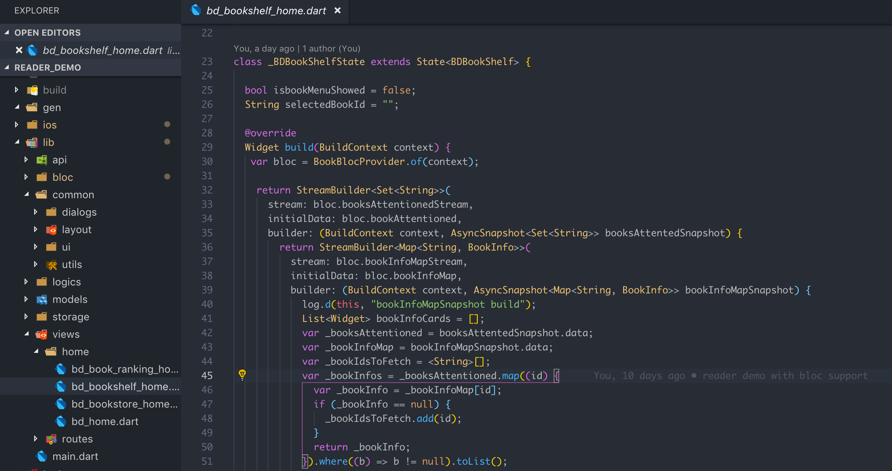

# VSCode 安装配置

### 简介

[VSCode](https://code.visualstudio.com/)，是一款微软开发的轻量级，高可定制代码编辑器。
配置简单，功能丰富。我用它开发 golang 后端应用，javascript 前端页面， flutter 客户端，开发体验非常好

### 配置

到官方下载安装，基本开箱即用。但可以通过一些插件的安装达到更好的编码体验

#### Atom One Dark Theme

钟爱 Atom One Dark 主题，而且这个主题在 VSCode 上表现是最好的，比 [Atom](https://github.com/atom/atom) 上还好

#### Flutter & Dart

两个打包安装，开发 Flutter 必备

#### Bracket Pair Colorizer

括号彩色匹配 Flutter UI 开发必备

#### Vetur

Vue 开发必备，提供了很多工具和 snippet

#### Output Colorizer

Output 不在是单色，容易分辨输出类别

#### Python

Python 语言工具包

#### vscode-icons

为各种文件类型提供 icon， 目录内容更容易分辨

#### ESLint

Javascript eslint 自动报错和纠错

#### GitLens

神器！！！在代码中嵌入 git 日志，必要信息和操作入口。在看代码的时候回溯版本脉弱变得轻而易举

#### Go

开发 Golang 项目必备

